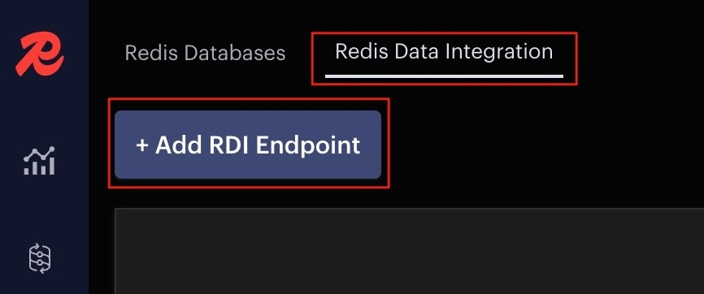
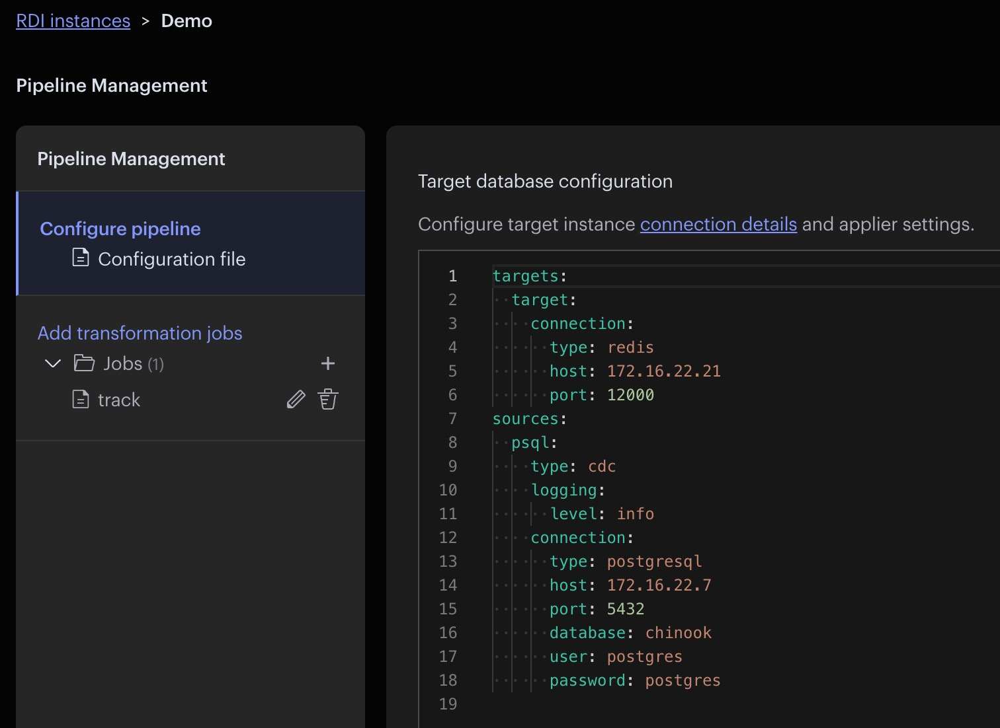
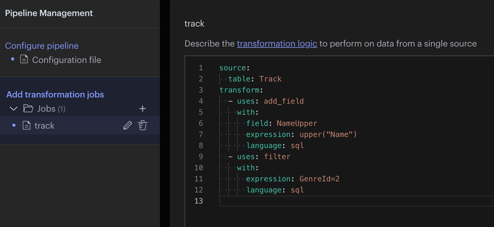
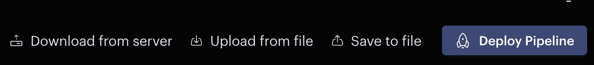
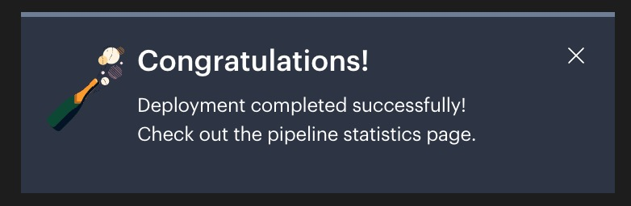

<div style="text-align: center;"></div>


------
<div style="font-family: 'Space Grotesk', monospace;">

# Redis Data Integration (RDI) Demo via PS Portal

This demo suite highlights Redis Data Integration (RDI) capabilities, including data migration and transformation between Redis and Postgres. It provides a step-by-step guide on installing, deploying, configuring, and transforming data within RDI.


### Use Case:

- <a href="#demo1">Ingest tracks from a music Postgres database to Redis</a>

------

# Topology


**Ingest Architecture in this environment.**

------

# Environment Details


| Resource                                                     | Details                                                      |
| ------------------------------------------------------------ | ------------------------------------------------------------ |
| <a href="https://8443-sp-$HOSTNAME.$DOMAIN/" target="_blank">Redis</a> | Version ${RE_VERSION}. Credentials: **admin@rl.org / redislabs** |
| <a href="https://3001-p-$HOSTNAME.$DOMAIN/" target="_blank">SQLPad</a> | Run queries against the Postgres database. Credentials: **admin@rl.org / redislabs** |
| <a href="https://5540-p-$HOSTNAME.$DOMAIN/" target="_blank">Redis Insight</a> | Redis Insight - Version ${REDIS_INSIGHT_VERSION}             |
| <a href="https://3000-p-$HOSTNAME.$DOMAIN/" target="_blank">Grafana</a> | Grafana - Version ${GRAFANA_VERSION}. Credentials: **admin / redislabs**             |
| <a href="https://9090-p-$HOSTNAME.$DOMAIN/" target="_blank">Prometheus</a> | Prometheus             |
| Music App                                                    | A Sample Application                                         |
| RDI                                                          | ${RDI_VERSION}                                               |


<h1 id="demo1">Demo 1: Ingest tracks from a music Postgres database to Redis</h1>


In this demo, we'll set up Redis Data Integration (RDI) to ingest data from a Postgres-based music track database. You'll learn how to leverage a transformation engine to add a new field (NameUpper), filter out records with a specific GenreId (2), and integrate customer table data.

### Step 1: Pre-check

Follow these step-by-step instructions to create the required databases in Redis UI:

#### 1. Create a **Target Database**

- Open the <a href="https://8443-sp-$HOSTNAME.$DOMAIN/" target="_blank">Redis Software UI</a>
- Click **Create Database**.
- Configure the database with the following settings:
   - **Database Type:** Single Region
   - **Name:** `target-db`
   - **Port:** `12000`
   - **Memory Limit:** `1 GB`
   - **Modules:** Enable *Search and Query* and *JSON* modules
- Click **Create** to finalize the setup.

#### 2. Create a **RDI Database**
- Create another database 
- Set up the database using the following configuration:
   - **Database Type:** Single Region
   - **Name:** `rdi-db`
   - **Port:** 12001
   - **Memory Limit:** `0.26 GB`
   - **Access Control:**
     - Select *Password-only authentication*.
     - Set the password to `redislabs`.
- Click **Create** to complete the process.

#### 3.  **Install RDI**

- SSH into the VM Box.
  - <a href="https://7681-p-$HOSTNAME.$DOMAIN/" target="_blank">Open Terminal</a>

  ```
  cd /content/rdi_install/${RDI_VERSION}/
  ```

  ```
  sudo ./install.sh -l DEBUG
  ```
  Password: `redislabs`

- Answer to the following questions

  - Please enter the RDI Redis database hostname or IP address: `172.16.22.21`

  - Please enter the RDI Redis database port: `12001`

  - Please enter the RDI Redis database username to use or press enter if you are using the default user:  `enter`

  - Please enter the RDI Redis database password to use []: `redislabs`

  - Do you want to use TLS? [y/N]: `N`

  - Please enter the https port to expose RDI API and other K3s services [443]:  `enter`

  - **WARNING** - Custom iptables rules found.
    iptables rules have been detected. These rules may interfere with the installation. Do you want to proceed? [y/N]: `Y`

  - CoreDNS does not allow a loopback address as an upstream DNS server. You can disable the DNS resolver and try again.
    Alternatively, you can enter the IP addresses of upstream DNS servers. Do you want to proceed? [y/N]: `Y`

  - **WARNING** - DNS resolver detected.
    Please enter the IP addresses of upstream DNS servers, separated by comma: `8.8.8.8,8.8.4.4`

  - Press select the source database type you want to use: 
    - 1: Mysql
    - 2: Oracle
    - 3: **Postgresql**
    - 4: Sqlserver
    Select a database type by index [1]: `3`

    

- Finally, you will get **Installation completed successfully!**


#### 4.  **Check the records in the Postgres DB**


- Open <a href="https://3001-p-$HOSTNAME.$DOMAIN/" target="_blank">SQLPad</a> and select the "Ingest-Postgres-DB" database connection. You should see the below. User: `admin@rl.org` and Password: `redislabs`

   <div style="text-align: left;"></div>

- Run a query against the 'Track' table and observe the current data present in the table.

  ```
  SELECT * FROM "Track"
  ```

- Open <a href="https://5540-p-$HOSTNAME.$DOMAIN/" target="_blank">Redis Insight</a>, accept Use recommended settings, Terms and conditions and click Submit. 
  - Click Add Redis database
  - Click Connection String with the following inormation
    - Database Alias: `target-db`
    - Host          : `172.16.22.21`
    - Port          : `12000`
    - Username      : `default`
  - Click Test Connection, upon receiving a successful message, click on Add Redis database

- Open the target-db and observe there are no keys

### Step 2: Prepare PostgresSQL for RDI

- <a href="https://7681-p-$HOSTNAME.$DOMAIN/" target="_blank">Open Terminal</a>

- Access the running PostgresSQL container

  ```
  sudo docker exec -it postgresql bash
  ```

- Use the `psql` command-line tool to connect to the PostgreSQL instance:

  ```
  psql -U postgres
  ```

- **Set `wal_level` Dynamically** Run the following SQL command to set the `wal_level` to `logical` dynamically

  ```	
  ALTER SYSTEM SET wal_level = 'logical';
  ```

  ```
  SELECT pg_reload_conf();
  ```
- Exit the psql shell. 
- Exit the  postgresql container  

- **Verify the Setting Is Persisted** The `ALTER SYSTEM` command modifies the `postgresql.auto.conf` file. To confirm it was updated, you can check its contents:

  ```
  sudo docker exec -it postgresql bash -c "cat /var/lib/postgresql/data/postgresql.auto.conf"
  ```

  Look for the line:

  ```
  wal_level = 'logical'
  ```

  If it's present, the setting has been written, but it won’t take effect until a restart.

  ```	
  sudo docker restart postgresql
  ```

- **Verify the Change** After the restart, re-enter the PostgreSQL instance and check the `wal_level` setting again:

  ```
  sudo docker exec -it postgresql psql -U postgres -c "SHOW wal_level;"
  ```

  you should see

  ```
  wal_level 
  -----------
  logical
  (1 row)
  ```

  

### Step 3: Deploy RDI

- Open <a href="https://5540-p-$HOSTNAME.$DOMAIN/" target="_blank">Redis Insight</a>

- Select Redis Data Integration and then click Add RDI Endpoint.

  <div style="text-align: left;"></div>


- Enter the following values
  - RDI Alias: `Demo`
  - URL      : `https://${HOST_IP}`
  - Password : `redislabs`


- You will receive a confirmation below once it has been successfully added.

- Select `Demo`
  
- Select Create New Pipeline.

- Click Cancel

- Copy and paste the configuration below into the Configuration file.

  ```
  targets:
    target:
      connection:
        type: redis
        host: 172.16.22.21
        port: 12000
  
  sources:
    psql:
      type: cdc
      logging:
        level: info
      connection:
        type: postgresql
        host: 172.16.22.7
        port: 5432
        database: chinook
        user: postgres
        password: postgres
                          
  ```

  
  <div style="text-align: left;"></div>

- Click + enter the job name, Click the check icon. Select the job name and then copy and paste the configuration below into the job.

  ```
  source:
    table: Track
  
  transform:
    - uses: add_field
      with:
        field: NameUpper
        expression: upper("Name")
        language: sql
  
    - uses: filter
      with:
        expression: GenreId = 2
        language: sql
                  
  ```
  
  <div style="text-align: left;"></div>

- Click Deploy Pipeline..

  <div style="text-align: left;"></div>

- You will receive a confirmation below once it has been successfully deployed.

  <div style="text-align: left;"></div>


### Step 4: Load data into the Track table

- Using <a href="https://3001-p-$HOSTNAME.$DOMAIN/" target="_blank">SQLPad</a>

  - Add some data to source
    - Go back to the tab with SQLPad
    - INSERT a row that meets the criteria (i.e. GenreId = 2)
    ```
      INSERT INTO "Track" ("TrackId", "Name", "AlbumId", "MediaTypeId", "GenreId", "Composer", "Milliseconds", "Bytes", "UnitPrice") VALUES (2, 'Sample Song 2', 1, 1, 2, 'John Doe', 180000, 4000, 0.99);
    ```
    - INSERT a row that does not meet the criteria (i.e. GenreId ≠ 2)
    ```
      INSERT INTO "Track" ("TrackId", "Name", "AlbumId", "MediaTypeId", "GenreId", "Composer", "Milliseconds", "Bytes", "UnitPrice") VALUES (3, 'Sample Song 3', 1, 1, 3, 'John Doe', 180000, 4000, 0.99);
     ```

  - See the result in <a href="https://5540-p-$HOSTNAME.$DOMAIN/" target="_blank">Redis Insight</a>
    - Click `R` icon -> Redis Databases
    - Select `target-db` to view the keys. You should only see one: your new entry with GenreId = 2. The other did not get captured because it did not meet the criteria.


- Simulate client traffic with a simple script
  - <a href="https://7681-p-$HOSTNAME.$DOMAIN/" target="_blank">SSH into the VM</a>. You will be logged in as labuser

  - Generate INSERT statements against the Track table using a script.
   
    ```
    sudo docker exec -it loadgen bash
    ```


    ```
    cd /scripts && python3 generate_load.py
  
    ```

- Run a query against the Track table using <a href="https://3001-p-$HOSTNAME.$DOMAIN/" target="_blank">SQLPad</a>. Observe that records are now showing up in the table.

- Open the target-db connection through <a href="https://5540-p-$HOSTNAME.$DOMAIN/" target="_blank">Redis Insight</a> and observe there are records.

- Open the <a href="https://8081-p-$HOSTNAME.$DOMAIN/" target="_blank">Music App</a> and browse the selections.  Select "Jazz" from the dropdown. Since the app retrieves data from Redis, you should see a list of records that match the filter condition you applied previously in RDI.

- You may stop the load by pressing 'Ctrl+c' and exit out of 'loadgen'.

### Step 5: Monitoring

- **Configure Prometheus**
  - <a href="https://7681-p-$HOSTNAME.$DOMAIN/" target="_blank">SSH into the VM</a>
  - `sudo vi /content/prometheus/prometheus.yml` 
  - Add the following jobs in the `prometheus.yml` file. Once added, save the changes by pressing the `Escape` key, followed by `:wq!` and then `Enter`.

  ```
    - job_name: 're'
      static_configs:
        - targets:
          - 172.16.22.21:8070
      honor_labels: true
      tls_config:
        insecure_skip_verify: true
      scheme: https

    - job_name: 're_v2'
      static_configs:
        - targets:
          - 172.16.22.21:8070
      honor_labels: true
      metrics_path: '/v2/metrics'
      tls_config:
        insecure_skip_verify: true
      scheme: https

    - job_name: collector-source
      metrics_path: /metrics/collector-source
      static_configs:
        - targets: [${HOST_IP}]
      scheme: https
      tls_config:
        insecure_skip_verify: true

    - job_name: rdi
      metrics_path: /metrics/rdi
      static_configs:
        - targets: [${HOST_IP}]
      scheme: https
      tls_config:
        insecure_skip_verify: true
  ```
  - Restart Prometheus container on the terminal. If prompted for a password, enter **redislabs**

  ```
    sudo docker restart prometheus
  ```

- **Configure Ingress for Collector-sources**
  ```
    sudo vi /content/prometheus/ingress-collector-sources.yaml 
  ```
  Paste the following content in the file. Once added, save the changes by pressing the `Escape` key, followed by `:wq!` and then `Enter`.

  ```
  apiVersion: networking.k8s.io/v1
  kind: Ingress
  metadata:
    annotations:
      meta.helm.sh/release-name: rdi
      meta.helm.sh/release-namespace: rdi
      traefik.ingress.kubernetes.io/rewrite-target: /
      traefik.ingress.kubernetes.io/router.entrypoints: websecure
    generation: 1
    labels:
      app: collector-source-metrics-exporter
      app.kubernetes.io/managed-by: Helm
      product: rdi
    name: collector-source-metrics-exporter
    namespace: rdi
  spec:
    ingressClassName: traefik
    rules:
    - http:
        paths:
        - backend:
            service:
              name: collector-source-metrics-exporter
              port:
                number: 9092
          path: /metrics/collector-source
          pathType: Prefix
  status:
    loadBalancer: {} 
  ```
  - Apply using `kubectl`
  ```
    kubectl -n rdi apply -f ingress-collector-sources.yaml
  ```

- Go to <a href="https://9090-p-$HOSTNAME.$DOMAIN/" target="_blank">Prometheus</a>
  - On the top menu, Click Status -> Target health
  - You should see all the targets in Green.

- Click the pipeline status icon and observe that pipeline status in RedisInsight.

  <div style="text-align: left;"></div>


- Also, in <a href="https://3000-p-$HOSTNAME.$DOMAIN/" target="_blank">Grafana</a>, 
  - Log in with the username `admin` and password `redislabs` 
  - Click the hamburger menu icon on the left side top corner then select Dashboards. You will find the following dashboards listed:
    - BDB Dashboard
    - Cluster Dashboard
    - Node Dashboard
    - PostgreSQL Database
    - RDI Dashboard


